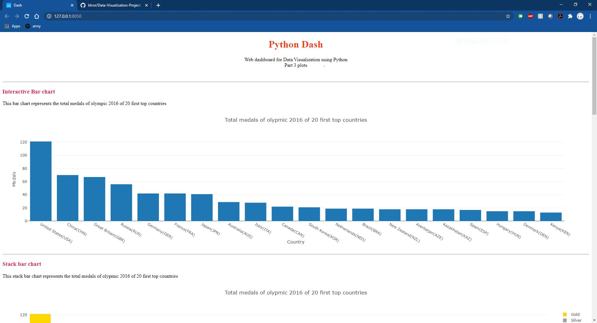

# Data-Visualization-Project
A group project from Spring 2020 that analyzes climate and Olympic sports data using the Pandas data-analysis library and plots the data using the Plotly graphing library. 

This was an old project I found on my laptop that I wanted to put on github to show my Python programming abilities. 
